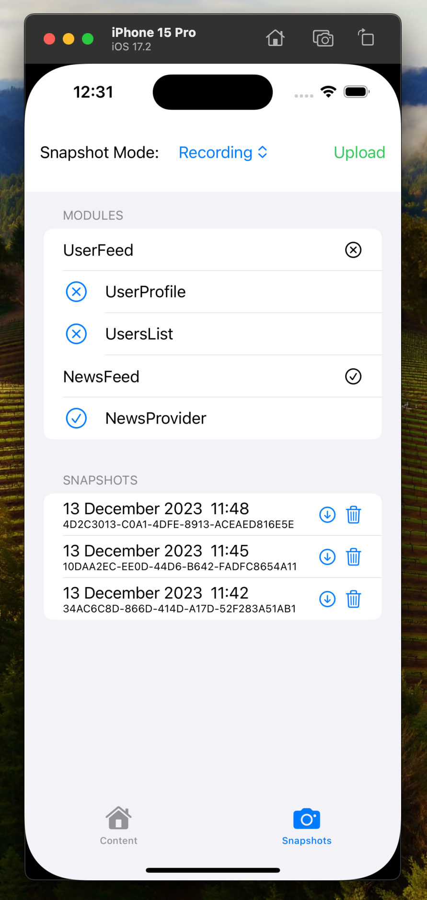

# OhSnap


OhSnap is a Swift library designed to empower Apple platform developers with ability to record and replay data the user saw when they encountered an issue with your app. 

It's built to capture and manage network data snapshots at the highest level possible, raw `Data` bytes, simplifying the debugging process by allowing to reproduce bugs in all layers from data decoding to UI. 

And the best thing is, integrating **OhSnap** into your project shouldn't take more than a few minutes!

The core of the library works with **zero external dependencies**, you can bring in your own server to store snapshots or use built-in Firebase integration target.

<br/>

> I've created this simple idea and algoritm back when I was leading The New York Times and it saved us months of time reproducing issues users were experiencing, no more manual reproduction steps on your staging env...

## Join Swifty Stack
This framework has been built as part of my engineering course [SwiftyStack](https://swiftystack.com/) in which I teach engineers how to save hours of development time every single week through techniques, frameworks and commercial tools, it's the only course like this in existence so highly recommend you join it. 

> If you use `OHSNAP` in the discount code, you'll get 10% off the course price.

## Demo
1. The app runs with **OhSnap** in `.recording` mode, automatically placing all raw `Data` files into a special folder
2. The user reports a bug, you ask **OhSnap** to record snapshot and send it to server, it generates a custom ID you can refer to.
3. On your device connected to debugger you simply load that snapshot and the app now switches into a replay mode and you can see EXACTLY what the user saw
4. You can fix bugs easily

https://github.com/krzysztofzablocki/OhSnap/assets/1468993/e0e68add-5f3a-47b5-b07a-4660f42e08f0

## Features

- 🔄 **Snapshot Recording & Replay**: Effortlessly record server data snapshots and replay them anytime to debug or test your app with user data scenarios.
- 🔒 **Thread-Safe**: With actor-isolation, OhSnap guarantees thread safety, making concurrent operations a breeze.
- ⏩ **Concurrency-Ready**: Adopting the latest async/await patterns in Swift, OhSnap provides a smooth asynchronous experience.
- 📱 **Built-In Control UI**: OhSnap comes bundled with agnostic SwiftUI snapshot controller that you can easily embeed into your app settings.
- 🛠 **Customizable Dependencies**: Comes with a set of customizable dependencies allowing you to define how files and settings are managed within your app.
- 🌐 **Bring your own server**: A protocol-defined server client (`OhSnapServerClient`) ensures a decoupled architecture, ready for any backend service.

## Getting Started

Integrating OhSnap into your project is straightforward:

Decide whether you want to roll your own server integration or use built-in Firebase, if you decide to leverage Firebase:

### via Xcode

Open your project, click on File → Swift Packages → Add Package Dependency…, enter the repository url (`https://github.com/krzysztofzablocki/OhSnap.git`) and add the package product `OhSnapFirebase` to your app target.

### via SPM package.swift

```swift
dependencies: [
    .package(url: "https://github.com/krzysztofzablocki/OhSnap.git", from: "1.0.0"),
]
```

### Example Usage

Here's a quick snippet to give you a taste of using OhSnap:

```swift
/// once at the start of your app
let ohSnapClient = OhSnapClient(
    defaultMode: .recording,
    restorePrevious: true,
    baseURL: .cachesDirectory.appending(path: "Snapshots"),
    fileManager: .live,
    userDefaults: .live
)

// Anywhere you process `NSData` objects:
let dataToUseNow = try await ohSnapClient.snapshot(dataFromServer, uniqueIdentifier: "uniqueID")
// Use your dataToUseNow as you did dataFromServer before
```

You can play with the example app in the repo if you run into any issues. 
*You'll need to setup NewsAPI key and Firebase Account.*

## Define Modules



**OhSnap** also supports defining data modules your app supports, you can describe what kind of unique endpoints your application is using and the UI will tell you whether your snapshots for a given module are complete or not. Use `.registerModule(name, [unique1, unique2])`.

## Contribution

OhSnap thrives on community contributions! Whether it's feature enhancements, bug fixes, or improving documentation, we welcome your pull requests and issues.

## License

OhSnap is released under the MIT license. See LICENSE for details.

